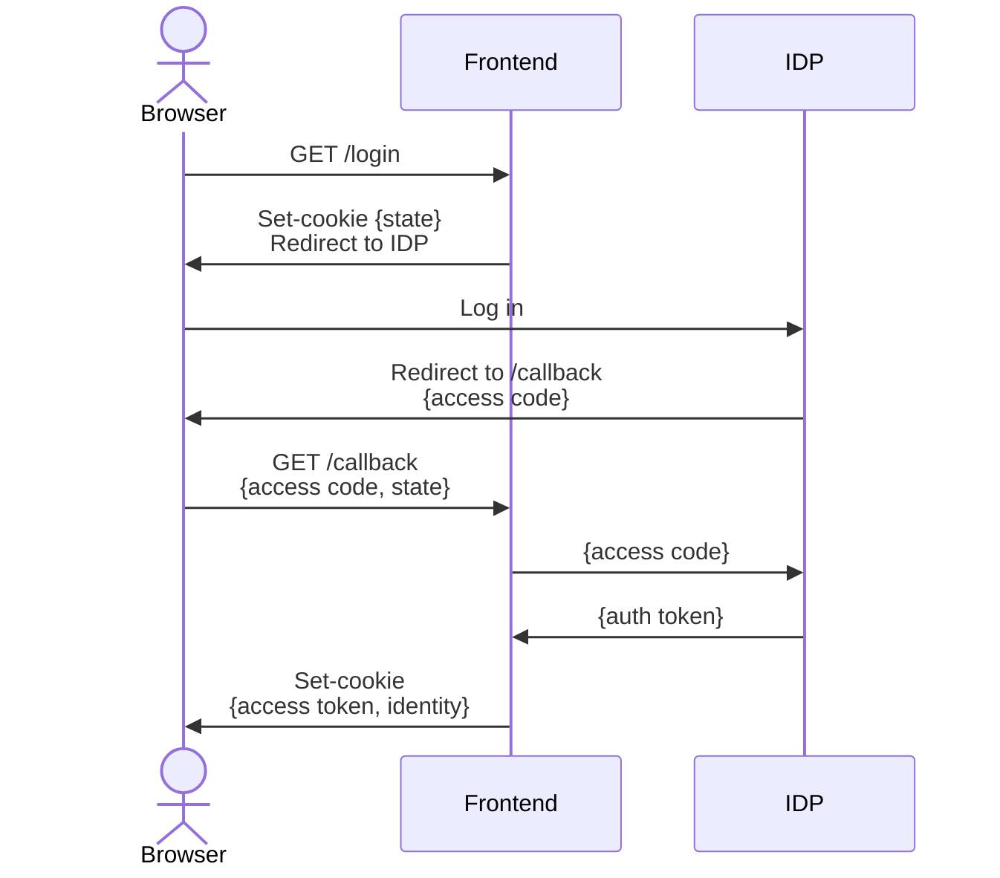

# Auth0 Demo

An OIDC demo project using Auth0 as the IDP.

```mermaid
sequenceDiagram
    actor Browser
    Browser->>Frontend: GET /login
    Frontend->>Browser: Set-cookie {state}<br>Redirect to IDP
    Browser->>IDP: Log in
    IDP->>Browser: Redirect to /callback<br>{access code}
    Browser->>Frontend: GET /callback<br>{access code, state}
    Frontend->>IDP: {access code}
    IDP->>Frontend: {auth token}
    Frontend->>Browser: Set-cookie<br>{access token, identity}
```